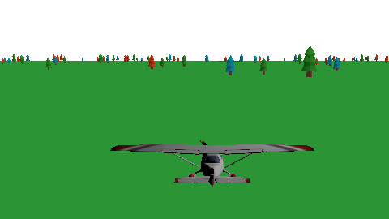
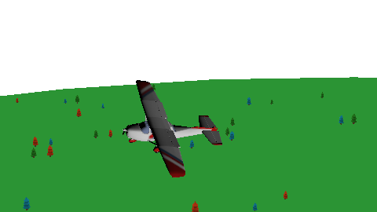

# Relatorio trabalho final Fundamentos de Computação Gráfica

### Integrantes

Afonso Hafner de Britto
Vítor Hugo Magnus Oliveira

## Contribuições de cada membro

Para realizar este trabalho, foram utilizados dois laboratórios como base: Lab2 e Lab5.
Ficou divido que o Afonso iria começar trabalhando com itens relacionados ao Lab5 e o Vítor com os itens relacionados ao Lab2 e após isso iríamos juntar os códigos e dividir, ou trabalhar conjuntamente, para preencher os outros requisitos.

Dentro do escopo do Lab5 foram trabalhados os seguintes requisitos:
- [X] Objetos virtuais representados através de malhas poligonais complexas (malhas de triângulos). 
    - O objeto com complexidade maior ou igual ao modelo "cow.obj" seria o "aviao.obj".
    - Essa tarefa ficou para o integrante Afonso.
- [X] No mínimo um objeto virtual deve ser copiado com duas ou mais instâncias, isto é, utilizando duas ou mais Model matrix aplicadas ao mesmo conjunto de vértices.
    - Para desenhar nosso avião e nossas árvores aplicamos diversas tranformações na nossa model matrix antes de usar a função de desenho na tela.
    - Essa tarefa ficou para o integrante Afonso.
- [X] Modelos de iluminação de objetos geométricos. 
    - O nosso avião possui iluminação com o modelo de Lambert e interpolação de Gouraud, enquanto nosso cenário possui iluminação com o modelo de Blinn-Phong e interpolação de Phong.
    - Essa tarefa ficou para o integrante Afonso.
- [X] Mapeamento de texturas. 
    - Todos os nossos objetos possuem texturas próprias, sendo que as texturas do avião e das árvores são prontas, enquanto que a textura da nossa ilha foi feita pelo integrante Vítor utilizando o software Blender.
    - Essa tarefa foi feita em conjunto.

Dentro do escopo do Lab2 foram trabalhando os seguintes requisitos:
- [X] Transformações geométricas de objetos virtuais. 
    - O jogador controla o avião através de interação com mouse e teclado.
    - Essa tarefa foi feita pelo integrante Vítor.
- [X] Controle de câmeras virtuais. 
    - O usuário pode alternar entre uma câmera livre e uma câmera look-at.
    - Essa tarefa foi feita pelo integrante Vítor.

Outros requisitos:
- [X] Animação de Movimento baseada no tempo.
    - O rotor do avião possui uma animação em que está girando.
    - Essa tarefa foi iniciada pelo integrante Afonso, mas foi finalizada com a ajuda do professor e do integrante Vítor.
- [X] Curvas de Bézier.
    - A câmera livre volta para a câmera look-at utilizando uma curva de Bézier cúbica.
    - Essa tarefa foi feita pelo integrante Vítor.
- [X] Testes de intersecção entre objetos virtuais. 
    - Nosso jogo possui colisão do tipo cubo-cubo (avião x árvores), cubo-plano (avião x solo) e cubo-meio-elipsóide (avião x ilha)
    - A primeira colisão foi feita pelo integrante Afonso, a segunda pelo integrante Vítor e a terceira foi feita em conjunto.

## Uso do ChatGPT

Sim, o ChatGPT foi utilizado em algumas partes do desenvolvimento do trabalho. O integrante Vítor fez uso do ChatGPT para auxiliar na tarefa de implementação da curva de Bézier, a IA criou um script em Python que representava o comportamento esperado; mesmo que a implementação feita em nosso jogo tenha sido bem diferente (já que o GPT utilizou bibliotecas e funções próprias de Python), foi de grande ajuda, já que debugar essa tarefa teria tomado muito tempo do projeto. O integrante Afonso fez uso para modelar a colisão cubo-cubo, a implementação da colisão estava matematicamente correta, porém, sempre ocorria intersecção, o ChatGPT foi de grande ajuda ao motrar que faltava aplicar as transformações aos pontos das bbox antes de fazer o teste; então, ele fez uma função que aplicava a model ás bbox, infelizmente a função estava errada e tivemos de consertar. Porém, o melhor uso que fizemos do ChatGPT foi para o Makefile; nós modularizamos bastante nosso código, criando diveros header files novos, e ao longo do tempo criavámos ainda mais, o ChatGPT então criou um Makefile para nós que linka automaticamente qualquer header file novo adicionado ao projeto, essa, com certeza, foi a maior contribuição da IA generativa para o nosso trabalho.

## Manual do usuário
- Shift: Acelara o avião
    - O avião só decola se sua velocidade é maior que 100Km/h
- Ctrl: Freia o avião
- AWSD
    - S: inclina o avião
    - W: declina o avião
    - AD: move o avião para os lados
- Espaço
    - Alterna entre os modos de câmera
    - R: volta com o avião para a origem

## Imagens da aplicação funcionando



## Compilação e execução
Para compilar e executar, é necessário estar utilizando um ambiente Linux.
```bash
git clone https://github.com/afonsodebritto/trab_final_fcg.git
```
```bash
cd trab_final_fcg
```
```bash
make run
```
